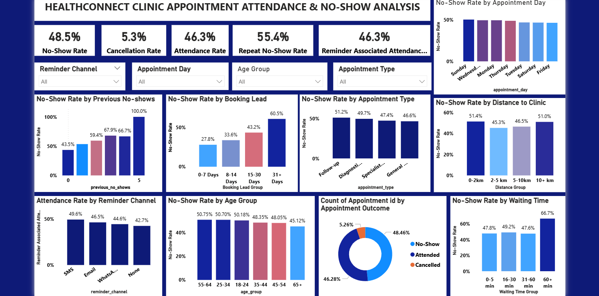
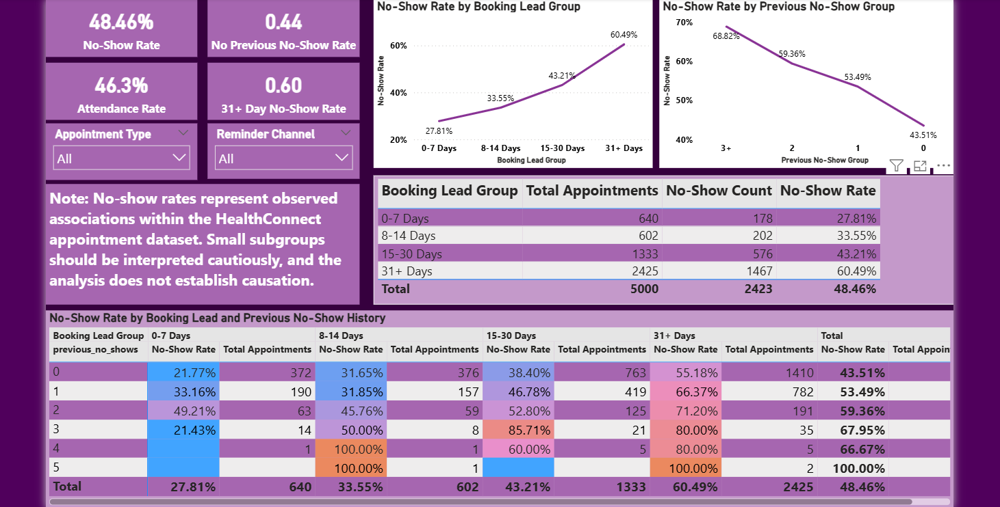
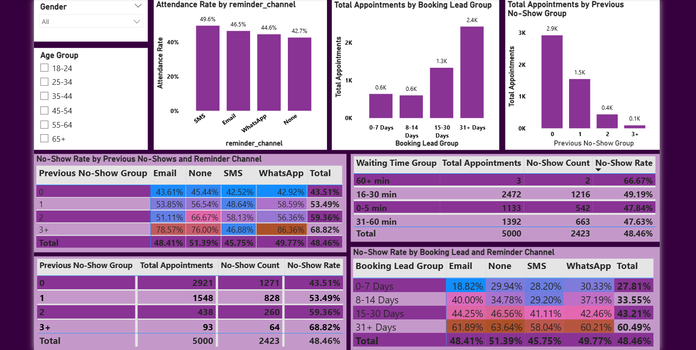
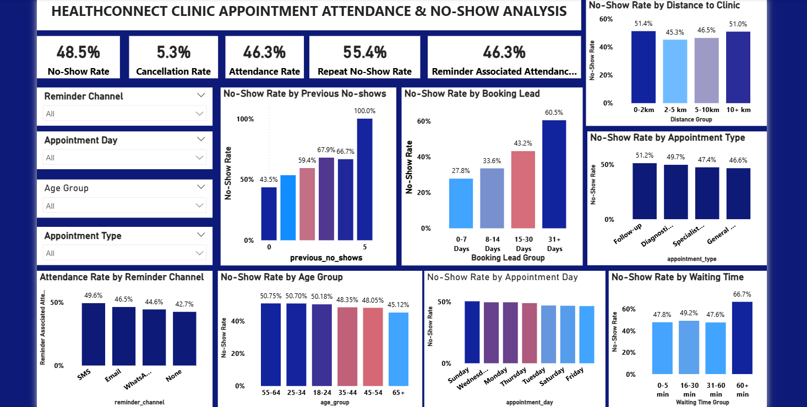
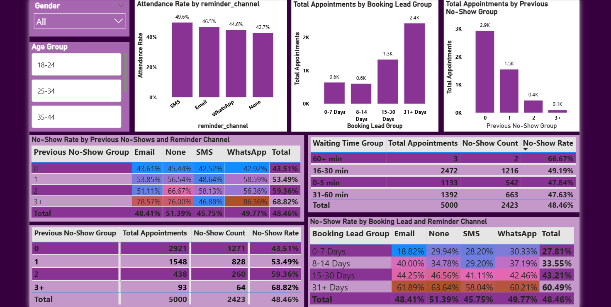
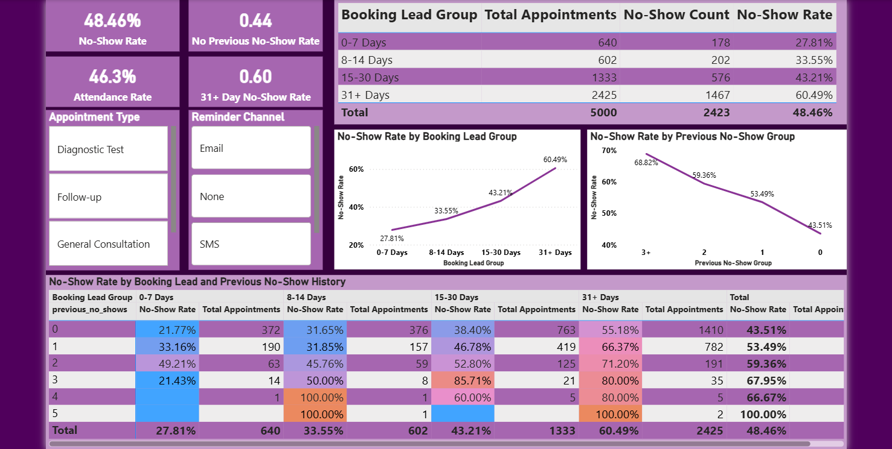

# HealthConnect Clinic No-Show Patterns
A data analytics project focused on understanding appointment attendance and no-show patterns at HealthConnect Clinic.

### Project Overview

HealthConnect Clinic is a fictional healthcare provider. This project focuses on using data analytics to understand appointment attendance and identify patterns associated with missed appointments.
This repository will develop across multiple stages.

Week 4 focused on understanding the business problem, reviewing the available data and Data Dictionary, assessing data quality, identifying relevant variables, and defining the questions and KPIs that will guide further analysis.

### Data Quality Assessment

Initial checks identified:

- No duplicate `appointment_id` records
- Approximately 1% missing values in `distance_to_clinic_km`
- Approximately 1% missing values in `waiting_time_minutes`
- Data types and categorical fields reviewed against the Data Dictionary

### Key Variables

Variables identified for further analysis include:

- Appointment type, day and time
- Age and gender
- Booking lead time
- Previous no-shows
- Reminder status and channel
- Distance to clinic
- Waiting time
- Appointment outcome

### Business Questions

The analysis will explore:

- What proportion of appointments are no-shows?
- Which appointment factors are associated with no-shows?
- Is previous no-show behaviour associated with future no-shows?
- Is reminder engagement associated with attendance?
- Does booking lead time relate to no-show behaviour?

## Proposed KPIs

The following KPIs were identified as potentially relevant to the business questions:

| KPI | Business Question |

|---|---|

| **No-Show Rate** | What proportion of appointments are no-shows? |

| **Attendance Rate** | What proportion of appointments are attended? |

| **Cancellation Rate** | How many scheduled appointments are cancelled? |

| **Reminder-Associated Attendance Rate** | Is reminder engagement associated with attendance? |

| **Repeat No-Show Rate** | Are repeat no-shows common? |

At this stage, the KPIs were identified and their relevance considered. They were not yet calculated or visualised.

---

## Initial Analysis Approach

The proposed analytical approach for the next stage is to:
1. Review and prepare the dataset.
2. Address identified data-quality issues.
3. Examine appointment volumes and appointment outcomes.
4. Investigate no-show patterns across relevant variables.
5. Calculate the selected KPIs.
6. Compare patterns across relevant appointment and patient groups.
7. Interpret the findings and identify meaningful business insights.### Proposed KPIs

---

### Exploratory Analysis & KPI Development

Week 5 progressed the HealthConnect Clinic Data Analytics project from initial planning and data understanding into exploratory analysis, KPI development and business insight generation.

### Work Completed

- Conducted exploratory analysis of appointment attendance and no-show patterns.
- Calculated key appointment performance KPIs.
- Analysed no-show patterns across patient, appointment, booking and operational characteristics.
- Investigated the relationship between previous no-show history and future appointment outcomes.
- Analysed booking lead time, reminder channels, appointment type, appointment day, age group, distance to clinic and waiting time.
- Developed and refined Power BI visualisations to communicate the findings.
- Applied conditional formatting to improve interpretation of high- and low-risk segments.
- Developed business insights and recommendations based on observed patterns.
- Documented analytical limitations and areas requiring further investigation.

### Key KPIs

| KPI | Result |
|---|---:|
| No-Show Rate | 48.5% |
| Cancellation Rate | 5.3% |
| Attendance Rate | 46.3% |
| Repeat No-Show Rate | 55.4% |

### Key Findings

The analysis identified several notable patterns:

1. No-shows represent the largest appointment outcome category.
2. Appointments involving patients with previous no-show history show higher no-show rates.
3. Longer booking lead times are associated with higher observed no-show rates.
4. Attendance patterns vary across reminder channels.
5. Longer waiting times are associated with higher observed no-show rates.

These findings represent observed associations in the dataset and should not be interpreted as evidence of causation.

### Dashboard Preview

## Advanced Analytics & Decision Support

Extended the HealthConnect analysis from exploratory data analysis into deeper relationship analysis and decision support.

### Key Activities

- Analysed No-Show Rate by Booking Lead Group
- Analysed No-Show Rate by Previous No-Show Group
- Created a Previous No-Show Group for deeper segmentation
- Examined the relationship between Booking Lead and Previous No-Show History
- Analysed Previous No-Show History across Reminder Channels
- Validated and refined findings from the previous analysis
- Identified high-impact findings and operational recommendations

### Cross-Track Integration

The Analytics track prepared a structured handoff for potential Data Science integration. Candidate modelling variables included booking lead time, previous no-show history, reminder channel, and the interaction between booking lead and previous no-show history.

An analytical findings and proposed modelling requirements were documented as a foundation for future Data Science integration.

### Advanced Analysis Dashboard Preview

### Key Insights

1. No-show rates increased across the booking lead groups, indicating that appointments booked further in advance require further investigation and monitoring.
2. Patients with previous no-show history generally showed higher current no-show rates.
3. Combining booking lead time with previous no-show history provided a deeper view of higherrisk appointment segments.
4. Differences were observed across reminder channels, providing an area for further evaluation.
5. Segment volumes were considered alongside rates to avoid overinterpreting results from small groups.

**Tools:** Microsoft Excel | Power Query | GitHub

## Week 7 – Testing, Refinement & End-to-End Validation

Week 7 focused on systematically testing and validating the analytical outputs developed during the previous phases of the HealthConnect project.

### Key Activities

- Validated the major HealthConnect KPIs against the underlying dataset
- Checked Power BI dashboard values for consistency with the source data
- Tested important analytical findings and segmented results
- Validated Booking Lead and Previous No-Show analyses
- Tested key analytical matrices and dashboard filters
- Reviewed dashboard visuals for clarity, duplication and usability
- Refined dashboard components based on testing and analytical relevance
- Retested important outputs after validation and refinement
- Documented testing results, decisions, limitations and remaining dependencies
- Prepared validated analytical findings for potential cross-track integration

### Testing & Validation

The Week 7 testing process covered:

- KPI validation
- Analytical validation
- Dashboard calculation checks
- Filter and interaction testing
- Matrix validation
- Visual and usability review
- Retesting following refinement

Where no issue was identified, the output was recorded as successfully validated.

### Key Validated Findings

The analysis confirmed the relevance of several patterns identified during Week 6, including:

- Differences in no-show rates across booking lead time groups
- Relationship between previous no-show history and subsequent no-show behaviour
- Combined patterns between booking lead time and previous no-show history
- Differences in no-show patterns across reminder channels

These findings were interpreted as observed relationships rather than causal effects.

### Cross-Track Testing

A Data Analytics to Data Science testing activity was planned to assess whether validated analytical findings could support future predictive modelling.

Potential modelling inputs included:

- Booking Lead Time
- Previous No-Show History
- Reminder Channel
- Booking Lead Time × Previous No-Show History

### Remodeled Dashboard Preview

